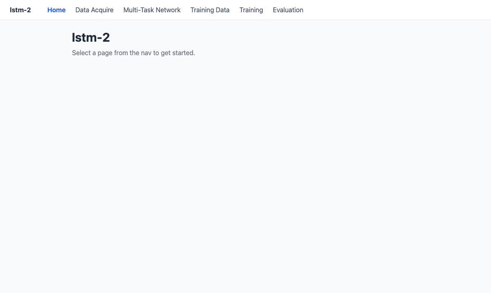
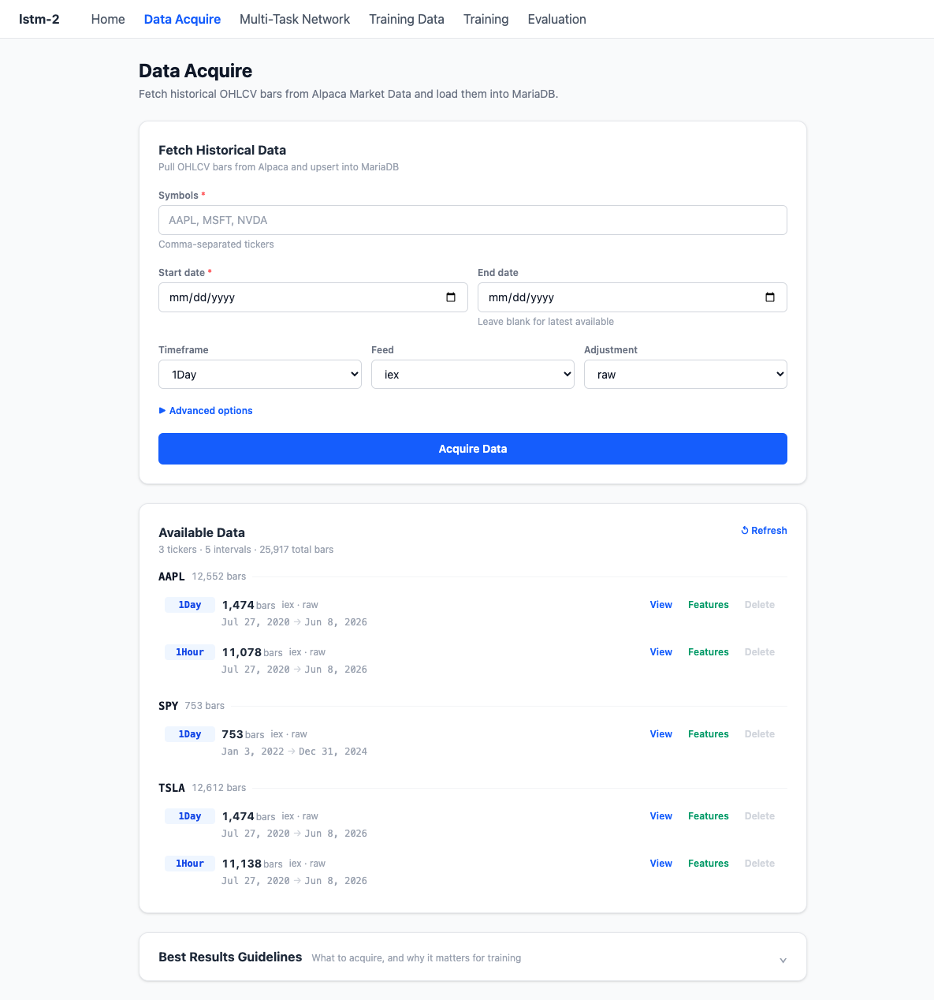
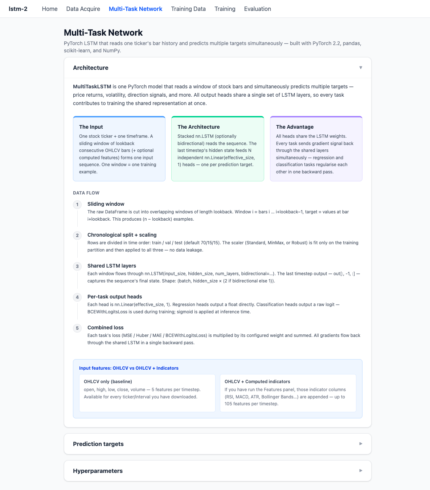
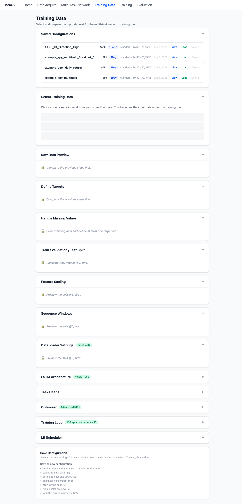
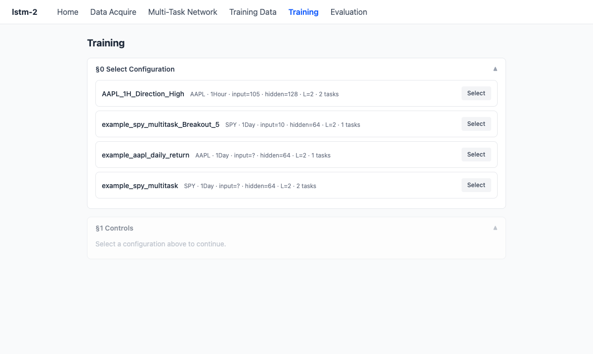
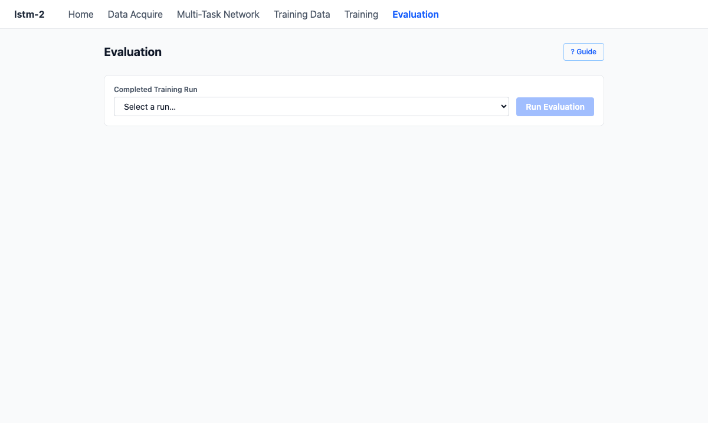

# lstm-2

A full-stack application for training and evaluating multi-task LSTM networks on financial bar data. Fetch historical OHLCV data, engineer features, configure training targets, train PyTorch models, and evaluate results — all through a browser UI backed by a FastAPI + MariaDB stack.

---

## Stack

| Layer | Technology |
|---|---|
| Backend | Python 3.12, FastAPI, SQLAlchemy 2.x (sync), PyMySQL |
| Frontend | React 18 (JS), Vite, TailwindCSS v4, React Router DOM v7 |
| Database | MariaDB (Docker Compose) |
| ML | PyTorch 2.2.2, scikit-learn, pandas, NumPy |
| Charts | lightweight-charts v5, Recharts |

---

## Quick Start

**1. Start the database**
```bash
cd mysql && docker compose up -d
```

**2. Set up Python environment**
```bash
python -m venv .venv
source .venv/bin/activate
pip install -e .
```

**3. Start the backend**
```bash
.venv/bin/python -m uvicorn src.api.main:app --reload --port 8000
```
Swagger UI: `http://localhost:8000/docs`

**4. Start the frontend**
```bash
cd src/frontend && npm install && npm run dev
```
App: `http://localhost:5173`

---

## Pages

### Home



Entry point. Use the nav to access any section of the pipeline.

---

### Data Acquire — `/data`



Fetch historical OHLCV bars from Alpaca Market Data and upsert them into MariaDB. Shows all stored symbols with bar counts and date ranges. From each interval you can:
- **View** — candlestick chart with optional feature overlays
- **Features** — compute and save technical indicators (100 indicators across 6 categories: Trend, Momentum, Volatility, Volume, Trend Strength, Price Action)
- **Delete** — remove all bars for that symbol/timeframe/feed/adjustment

Includes a **Best Results Guidelines** section covering recommended bar counts, symbol quality, timeframe selection, adjustment types, and feed options.

---

### Multi-Task Network — `/multi-task-network`



Architecture reference for the `MultiTaskLSTM` model. Documents the model design: stacked bidirectional LSTM layers with N independent output heads — one per prediction target. All heads share the LSTM weights so every task regularises the shared representation simultaneously. Covers the full data flow from sliding window construction through chronological train/val/test splitting, feature scaling, and loss aggregation.

---

### Training Data — `/training-data`



Configure and save training datasets. Select a symbol/timeframe, choose feature columns, define prediction targets (direction, return_frac, return_pct, log_return, realized_vol, MFE/MAE, breakout, large_move), and set train/val/test split ratios and lookback window. Saved configurations are named and reused across training runs.

---

### Training — `/training`



Select a saved configuration and launch a training run. Set hyperparameters (hidden size, layers, dropout, optimizer, learning rate, scheduler, early stopping patience, per-task loss functions and weights). Live progress shows epoch loss curves for each task. Supports early stopping and mid-run cancellation. Best-epoch model checkpoint and scaler are saved to `models/config_{id}/`.

---

### Evaluation — `/evaluation`



Evaluate a completed training run against its held-out test set. Results are cached in the database after the first run.

**Metrics tab** — per-task metrics and charts:
- Regression: MSE, MAE, RMSE, R², Direction Accuracy + Timeline, Scatter, Residual Histogram
- Classification: Accuracy, Precision, Recall, F1 + Confusion Matrix

**Chart tab** — candlestick chart for the run's symbol/timeframe with:
- Technical indicator overlays from the config's feature columns
- Classification predictions as ▲/▼ candle markers (green = correct, red = incorrect)
- Regression task predictions vs actuals as synced sub-panes below the main chart

---

## Project Structure

```
lstm-2/
├── main.py                   # App entry point
├── src/
│   ├── api/
│   │   ├── main.py           # FastAPI app, router registration, table creation
│   │   ├── database.py       # SQLAlchemy engine + get_db() dependency
│   │   ├── models/           # ORM models (all tables prefixed lstm_2_)
│   │   ├── schemas/          # Pydantic request/response schemas
│   │   ├── routers/          # Route handlers (bars, features, training_data, training)
│   │   └── training/         # Pipeline, runner, model definition
│   └── frontend/
│       └── src/
│           ├── App.jsx        # Routes
│           ├── components/    # CandleChart, SubPane, Layout
│           ├── lib/           # chartTime.js shared utility
│           └── pages/         # One file per page
├── mysql/                    # Docker Compose MariaDB service
│   ├── docker-compose.yml
│   └── mysql-conf/my.cnf
├── models/                   # Saved model checkpoints (config_{id}/run_{id}_epoch_{n}.pt)
└── docs/
    ├── REQUESTS.md
    └── screen-shots/
```

---

## Database

MariaDB runs in Docker. All tables are prefixed `lstm_2_`. Connection config lives in `.env` (root) and `mysql/.env`.

```bash
# Start
cd mysql && docker compose up -d

# Connect
docker exec -it mysql_db mysql -uroot -p

# Backup
docker run --rm -v mariadb_data:/data -v $(pwd)/backup:/backup ubuntu \
  tar cvf /backup/mariadb_backup_$(date +%F).tar /data
```

Two application users: `app_user` (full access from local subnet, for DBeaver) and `api_user` (SELECT/INSERT/UPDATE/DELETE from localhost, used by the API).

---

## Environment Variables

Create `.env` in the project root:
```env
DB_HOST=localhost
DB_PORT=3306
DB_NAME=app_db
DB_USER=api_user
DB_PASSWORD=your_password
ALPACA_API_KEY=your_key
ALPACA_SECRET_KEY=your_secret
```

Create `mysql/.env` for the Docker database service (see `mysql/NOTES.md`).
